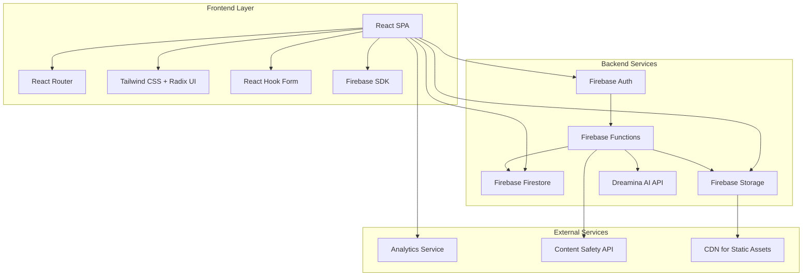
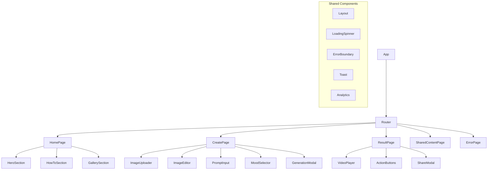
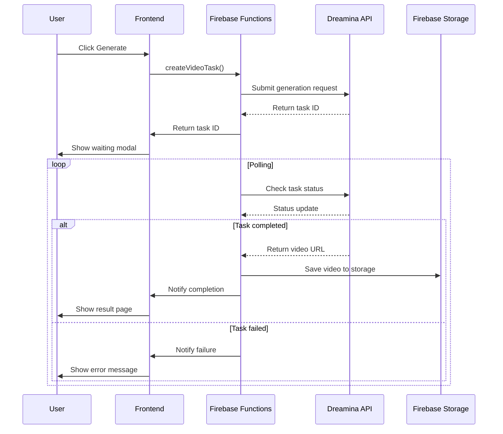

# Design Document

## Overview

The Children's Art Animation platform is a React-based web application that transforms children's drawings into animated videos using AI technology. The system leverages Firebase for backend services, integrates with third-party AI video generation APIs (Dreamina), and provides a seamless user experience across mobile and desktop devices.

The architecture follows a modern JAMstack approach with React frontend, Firebase backend services, and cloud storage for media assets. The design prioritizes mobile-first responsive design, performance optimization, and viral sharing capabilities.

## Architecture

### High-Level Architecture



### Technology Stack

**Frontend:**
- React 18 with TypeScript
- Vite for build tooling
- React Router for navigation
- Tailwind CSS + Radix UI for styling
- React Hook Form + Zod for form validation
- React Image Crop for image editing
- React Dropzone for file uploads

**Backend:**
- Firebase Authentication (optional for MVP)
- Firebase Functions for serverless API
- Firebase Firestore for data storage
- Firebase Storage for media files
- Firebase Hosting for deployment

**Third-Party Integrations:**
- Dreamina AI API for video generation
- Google Analytics for event tracking
- Content safety API for image moderation

## Components and Interfaces

### Core Components Architecture



### Key Component Interfaces

#### ImageUploader Component
```typescript
interface ImageUploaderProps {
  onImageUpload: (file: File) => void;
  onError: (error: string) => void;
  maxSize: number; // 5MB
  acceptedFormats: string[]; // ['image/jpeg', 'image/png']
}

interface ImageUploaderState {
  isDragActive: boolean;
  isUploading: boolean;
  uploadProgress: number;
  error: string | null;
}
```

#### ImageEditor Component
```typescript
interface ImageEditorProps {
  imageFile: File;
  onCropComplete: (croppedImage: Blob) => void;
  onCancel: () => void;
}

interface CropData {
  x: number;
  y: number;
  width: number;
  height: number;
}
```

#### VideoGenerator Service
```typescript
interface VideoGenerationRequest {
  imageBlob: Blob;
  prompt: string;
  musicMood: 'lively' | 'warm' | 'epic';
  aspectRatio: '16:9' | '9:16' | '1:1';
}

interface VideoGenerationResponse {
  taskId: string;
  status: 'pending' | 'processing' | 'completed' | 'failed';
  videoUrl?: string;
  error?: string;
}
```

### Data Models

#### Video Task Model
```typescript
interface VideoTask {
  id: string;
  userId?: string; // Optional for anonymous users
  imageUrl: string;
  prompt: string;
  musicMood: string;
  aspectRatio: string;
  status: 'pending' | 'processing' | 'completed' | 'failed';
  videoUrl?: string;
  shareId?: string; // For public sharing
  createdAt: Timestamp;
  updatedAt: Timestamp;
  completedAt?: Timestamp;
  error?: string;
}
```

#### Analytics Event Model
```typescript
interface AnalyticsEvent {
  eventName: string;
  userId?: string;
  sessionId: string;
  timestamp: number;
  properties: Record<string, any>;
  page: string;
  userAgent: string;
}
```

## Error Handling

### Error Categories and Responses

1. **Upload Errors**
   - File size exceeded: "图片太大了，请选择小于5MB的图片"
   - Invalid format: "请选择JPG或PNG格式的图片"
   - Network error: "上传失败，请检查网络连接"

2. **Generation Errors**
   - API timeout: "魔法棒似乎坏了，请稍后再试"
   - Content safety: "图片内容不符合要求，请选择其他图片"
   - Rate limit: "今天的魔法次数用完了，明天再来吧"

3. **System Errors**
   - Network disconnection: "网络连接中断，请检查网络"
   - Server error: "服务暂时不可用，请稍后重试"

### Error Handling Strategy

```typescript
interface ErrorHandler {
  handleUploadError(error: UploadError): void;
  handleGenerationError(error: GenerationError): void;
  handleNetworkError(error: NetworkError): void;
  showUserFriendlyMessage(message: string): void;
}

class ErrorBoundary extends React.Component {
  // Catches JavaScript errors anywhere in child component tree
  // Logs error details and shows fallback UI
}
```

## Testing Strategy

### Testing Pyramid

1. **Unit Tests (70%)**
   - Component rendering and props
   - Utility functions
   - Form validation logic
   - Image processing functions
   - Analytics event tracking

2. **Integration Tests (20%)**
   - User flow from upload to generation
   - Firebase service integration
   - API error handling
   - State management across components

3. **End-to-End Tests (10%)**
   - Complete user journey
   - Cross-browser compatibility
   - Mobile responsiveness
   - Performance benchmarks

### Test Implementation

```typescript
// Example unit test
describe('ImageUploader', () => {
  it('should validate file size', () => {
    const file = new File([''], 'test.jpg', { type: 'image/jpeg' });
    Object.defineProperty(file, 'size', { value: 6 * 1024 * 1024 }); // 6MB
    
    const result = validateFileSize(file, 5 * 1024 * 1024);
    expect(result.isValid).toBe(false);
    expect(result.error).toContain('文件大小超过限制');
  });
});

// Example E2E test
test('complete creation flow', async ({ page }) => {
  await page.goto('/');
  await page.click('[data-testid="cta-button"]');
  
  // Upload image
  await page.setInputFiles('[data-testid="file-input"]', 'test-image.jpg');
  
  // Crop image
  await page.click('[data-testid="confirm-crop"]');
  
  // Enter prompt
  await page.fill('[data-testid="prompt-input"]', '小猫在月球上跳舞');
  
  // Select mood
  await page.click('[data-testid="mood-lively"]');
  
  // Generate
  await page.click('[data-testid="generate-button"]');
  
  // Wait for result
  await page.waitForSelector('[data-testid="video-player"]');
  
  // Verify video is playable
  const video = page.locator('[data-testid="video-player"] video');
  await expect(video).toBeVisible();
});
```

### Performance Testing

- **Lighthouse CI** for performance metrics
- **Bundle analyzer** for code splitting optimization
- **Image optimization** testing for different formats
- **API response time** monitoring

## Implementation Details

### State Management

Using React's built-in state management with Context API for global state:

```typescript
interface AppState {
  currentStep: 'upload' | 'edit' | 'prompt' | 'generating' | 'result';
  imageFile: File | null;
  croppedImage: Blob | null;
  prompt: string;
  musicMood: string;
  generationTask: VideoTask | null;
  error: string | null;
}

const AppContext = React.createContext<{
  state: AppState;
  dispatch: React.Dispatch<AppAction>;
}>();
```

### Routing Strategy

```typescript
const router = createBrowserRouter([
  {
    path: '/',
    element: <Layout />,
    errorElement: <ErrorPage />,
    children: [
      { index: true, element: <HomePage /> },
      { path: 'create', element: <CreatePage /> },
      { path: 'result/:taskId', element: <ResultPage /> },
      { path: 'view/:shareId', element: <SharedContentPage /> },
    ],
  },
]);
```

### Image Processing Pipeline

1. **Upload Validation**
   - File type checking (MIME type + extension)
   - File size validation (client + server)
   - Basic image format verification

2. **Client-Side Processing**
   - Image cropping using react-image-crop
   - Canvas-based image resizing for optimization
   - Blob generation for upload

3. **Server-Side Processing**
   - Content safety scanning
   - Image optimization and format conversion
   - Secure storage in Firebase Storage

### Video Generation Workflow



### Analytics Implementation

```typescript
class AnalyticsService {
  private gtag: any;
  
  constructor() {
    // Initialize Google Analytics
    this.initializeGA();
  }
  
  trackEvent(eventName: string, properties: Record<string, any>) {
    this.gtag('event', eventName, {
      ...properties,
      timestamp: Date.now(),
      page: window.location.pathname,
    });
  }
  
  trackPageView(page: string) {
    this.gtag('config', 'GA_MEASUREMENT_ID', {
      page_path: page,
    });
  }
}

// Usage in components
const analytics = useAnalytics();

const handleCTAClick = () => {
  analytics.trackEvent('cta_click_start_creation', {
    source: 'homepage_hero',
    user_type: 'anonymous',
  });
  navigate('/create');
};
```

### Social Sharing and Open Graph Implementation

**Critical for Viral Growth (K-Factor)**

Since React SPA cannot be properly crawled by social media platforms, we need server-side rendering for shared content:

```typescript
// Firebase Function for OG tag generation
export const renderSharedContent = functions.https.onRequest(async (req, res) => {
  const shareId = req.path.split('/')[2]; // Extract from /view/:shareId
  
  try {
    const taskDoc = await db.collection('videoTasks').doc(shareId).get();
    if (!taskDoc.exists) {
      return res.redirect('/');
    }
    
    const task = taskDoc.data();
    const ogTags = `
      <meta property="og:title" content="看看这个神奇的儿童画动画！" />
      <meta property="og:description" content="${task.prompt}" />
      <meta property="og:image" content="${task.imageUrl}" />
      <meta property="og:video" content="${task.videoUrl}" />
      <meta property="og:url" content="${req.url}" />
      <meta property="og:type" content="video.other" />
    `;
    
    // Return HTML with OG tags + React app
    res.send(generateHTMLWithOGTags(ogTags));
  } catch (error) {
    res.redirect('/');
  }
});
```

### Performance Optimizations

**Current Implementation: Polling**
- Simple and reliable for MVP
- 5-second intervals with 60 attempts max
- Handles network failures gracefully

**Future V2 Enhancement: Real-time Communication**
```typescript
// Future implementation with Server-Sent Events
export const videoGenerationStream = functions.https.onRequest((req, res) => {
  res.writeHead(200, {
    'Content-Type': 'text/event-stream',
    'Cache-Control': 'no-cache',
    'Connection': 'keep-alive'
  });
  
  // Stream real-time updates to client
  const sendUpdate = (data: any) => {
    res.write(`data: ${JSON.stringify(data)}\n\n`);
  };
  
  // Monitor Firestore changes and push updates
});
```

**Firebase Functions Cold Start Mitigation**
- Monitor `createVideoTask` function performance
- Consider setting minimum instances for core functions if latency > 3s
- Implement function warming strategies for peak hours

### User State Recovery and Task Persistence

**Critical for User Experience Continuity**

```typescript
interface VideoTask {
  // ... existing fields
  sessionId: string; // For anonymous user task association
  expiresAt?: Timestamp; // Auto-delete after 90 days for anonymous users
  accessCount: number; // Track usage for cleanup decisions
  lastAccessedAt: Timestamp;
}

// Client-side task recovery
class TaskRecoveryService {
  private static STORAGE_KEY = 'activeTaskIds';
  
  static saveActiveTask(taskId: string) {
    const activeTasks = this.getActiveTasks();
    activeTasks.push(taskId);
    localStorage.setItem(this.STORAGE_KEY, JSON.stringify(activeTasks));
  }
  
  static getActiveTasks(): string[] {
    const stored = localStorage.getItem(this.STORAGE_KEY);
    return stored ? JSON.parse(stored) : [];
  }
  
  static async checkPendingTasks(): Promise<VideoTask[]> {
    const taskIds = this.getActiveTasks();
    const pendingTasks = [];
    
    for (const taskId of taskIds) {
      const task = await getTaskStatus(taskId);
      if (task && ['pending', 'processing'].includes(task.status)) {
        pendingTasks.push(task);
      } else if (task?.status === 'completed') {
        // Remove completed tasks from localStorage
        this.removeActiveTask(taskId);
      }
    }
    
    return pendingTasks;
  }
}

// Usage in App component
useEffect(() => {
  const checkRecovery = async () => {
    const pendingTasks = await TaskRecoveryService.checkPendingTasks();
    if (pendingTasks.length > 0) {
      showRecoveryModal(pendingTasks);
    }
  };
  
  checkRecovery();
}, []);
```

### Intelligent Aspect Ratio Detection

**Automatic Aspect Ratio Selection (Recommended)**

```typescript
interface ImageEditorProps {
  imageFile: File;
  onCropComplete: (croppedImage: Blob, aspectRatio: string) => void;
  onCancel: () => void;
}

const detectAspectRatio = (cropData: CropData): string => {
  const { width, height } = cropData;
  const ratio = width / height;
  
  if (ratio > 1.5) return '16:9'; // Landscape
  if (ratio < 0.7) return '9:16'; // Portrait
  return '1:1'; // Square
};

// In ImageEditor component
const handleCropComplete = (cropData: CropData) => {
  const aspectRatio = detectAspectRatio(cropData);
  const croppedBlob = generateCroppedImage(cropData);
  onCropComplete(croppedBlob, aspectRatio);
};
```

### Operational Monitoring and Cost Dashboard

**Analytics and Cost Tracking**

```typescript
interface OperationalMetrics {
  timestamp: Timestamp;
  eventType: 'task_created' | 'task_completed' | 'task_failed' | 'api_call';
  taskId: string;
  userId?: string;
  sessionId: string;
  apiCost?: number; // Estimated cost per API call
  processingTime?: number; // Time from creation to completion
  errorCode?: string;
  metadata: Record<string, any>;
}

// Cost tracking service
class CostTrackingService {
  static async logAPICall(taskId: string, type: string, cost: number) {
    await db.collection('operationalMetrics').add({
      timestamp: admin.firestore.FieldValue.serverTimestamp(),
      eventType: 'api_call',
      taskId,
      apiCost: cost,
      metadata: { apiType: type }
    });
  }
  
  static async generateDailyReport() {
    const today = new Date();
    const startOfDay = new Date(today.setHours(0, 0, 0, 0));
    
    const metrics = await db.collection('operationalMetrics')
      .where('timestamp', '>=', startOfDay)
      .get();
    
    return {
      totalTasks: metrics.docs.filter(d => d.data().eventType === 'task_created').length,
      completedTasks: metrics.docs.filter(d => d.data().eventType === 'task_completed').length,
      totalCost: metrics.docs.reduce((sum, doc) => sum + (doc.data().apiCost || 0), 0),
      averageProcessingTime: calculateAverageProcessingTime(metrics.docs)
    };
  }
}
```

### Configuration Management System

**Decoupled Magic Parameters**

```typescript
// Firestore configuration structure
interface ConfigurationDocument {
  musicMoodMap: {
    [key: string]: {
      apiValue: string;
      label: string;
      description?: string;
    };
  };
  promptTemplates: Array<{
    id: string;
    text: string;
    category: string;
    isActive: boolean;
  }>;
  systemSettings: {
    maxFileSize: number;
    rateLimitPerIP: number;
    videoGenerationTimeout: number;
  };
}

// Configuration service
class ConfigurationService {
  private static cache: ConfigurationDocument | null = null;
  
  static async getConfiguration(): Promise<ConfigurationDocument> {
    if (this.cache) return this.cache;
    
    const configDoc = await db.collection('configurations').doc('app').get();
    this.cache = configDoc.data() as ConfigurationDocument;
    
    // Cache for 5 minutes
    setTimeout(() => { this.cache = null; }, 5 * 60 * 1000);
    
    return this.cache;
  }
  
  static async getMusicMoodOptions() {
    const config = await this.getConfiguration();
    return Object.entries(config.musicMoodMap).map(([key, value]) => ({
      value: key,
      label: value.label,
      apiValue: value.apiValue
    }));
  }
}

// Usage in components
const MoodSelector = () => {
  const [moodOptions, setMoodOptions] = useState([]);
  
  useEffect(() => {
    ConfigurationService.getMusicMoodOptions().then(setMoodOptions);
  }, []);
  
  return (
    <div>
      {moodOptions.map(option => (
        <button key={option.value} value={option.value}>
          {option.label}
        </button>
      ))}
    </div>
  );
};
```

### CDN Distribution for Generated Content

**Firebase Hosting as CDN Frontend**

```typescript
// Firebase hosting configuration for CDN
// firebase.json
{
  "hosting": {
    "public": "dist",
    "rewrites": [
      {
        "source": "/api/video/**",
        "function": "serveVideoContent"
      },
      {
        "source": "/view/**",
        "function": "renderSharedContent"
      }
    ],
    "headers": [
      {
        "source": "/api/video/**",
        "headers": [
          {
            "key": "Cache-Control",
            "value": "public, max-age=31536000"
          }
        ]
      }
    ]
  }
}

// Video serving function with CDN optimization
export const serveVideoContent = functions.https.onRequest(async (req, res) => {
  const videoId = req.path.split('/').pop();
  
  try {
    const taskDoc = await db.collection('videoTasks').doc(videoId).get();
    if (!taskDoc.exists) {
      return res.status(404).send('Video not found');
    }
    
    const task = taskDoc.data();
    
    // Set CDN-friendly headers
    res.set({
      'Cache-Control': 'public, max-age=31536000',
      'Content-Type': 'video/mp4',
      'Access-Control-Allow-Origin': '*'
    });
    
    // Redirect to Firebase Storage URL (which is CDN-backed)
    res.redirect(302, task.videoUrl);
    
  } catch (error) {
    res.status(500).send('Server error');
  }
});
```

### Data Lifecycle Management

**Storage Cost Control Strategy**

```typescript
// Firebase Storage lifecycle rules
const storageLifecycleRules = {
  rule: [
    {
      condition: {
        age: 90, // days
        matchesPrefix: ['anonymous-users/']
      },
      action: {
        type: 'Delete'
      }
    }
  ]
};
```

**Data Retention Policy**
- Anonymous user content: 90 days
- Shared content with high engagement: 1 year
- System logs and analytics: 2 years
- User-generated content (if auth implemented): Indefinite with user control

### Third-Party API Integration Details

**Dreamina AI API Contract**

```typescript
// Our internal request format
interface VideoGenerationRequest {
  imageBlob: Blob;
  prompt: string;
  musicMood: 'lively' | 'warm' | 'epic';
  aspectRatio: '16:9' | '9:16' | '1:1';
}

// Actual Dreamina API payload mapping
interface DreaminaAPIRequest {
  image_url: string; // Uploaded to temporary storage first
  prompt: string; // Direct mapping
  style: 'cartoon' | 'realistic' | 'anime'; // Derived from musicMood
  aspect_ratio: '16:9' | '9:16' | '1:1'; // Direct mapping
  duration: 3; // Fixed 3 seconds for MVP
  music_style: 'happy' | 'peaceful' | 'dramatic'; // Mapped from musicMood
}

// Mapping logic
const mapToDreaminaRequest = (request: VideoGenerationRequest): DreaminaAPIRequest => ({
  image_url: uploadedImageUrl,
  prompt: request.prompt,
  style: 'cartoon', // Fixed for children's content
  aspect_ratio: request.aspectRatio,
  duration: 3,
  music_style: {
    'lively': 'happy',
    'warm': 'peaceful',
    'epic': 'dramatic'
  }[request.musicMood]
});
```

**API Response Handling**
```typescript
interface DreaminaAPIResponse {
  task_id: string;
  status: 'pending' | 'processing' | 'completed' | 'failed';
  result?: {
    video_url: string;
    thumbnail_url: string;
    duration: number;
  };
  error?: {
    code: string;
    message: string;
  };
}
```

### Security Considerations

1. **Content Safety**
   - Client-side basic validation
   - Server-side AI-powered content moderation
   - Rate limiting per IP address

2. **Data Privacy**
   - No personal data collection for anonymous users
   - Secure image storage with expiration policies
   - GDPR-compliant data handling

3. **API Security**
   - Firebase security rules for data access
   - CORS configuration for API endpoints
   - Input validation and sanitization

### Mobile Optimization

1. **Responsive Design**
   - Mobile-first CSS approach
   - Touch-friendly interface elements
   - Optimized image cropping for touch devices

2. **Performance**
   - Lazy loading for gallery images
   - Progressive image loading
   - Service worker for offline capabilities

3. **PWA Features**
   - Web app manifest
   - Installable app experience
   - Offline fallback pages