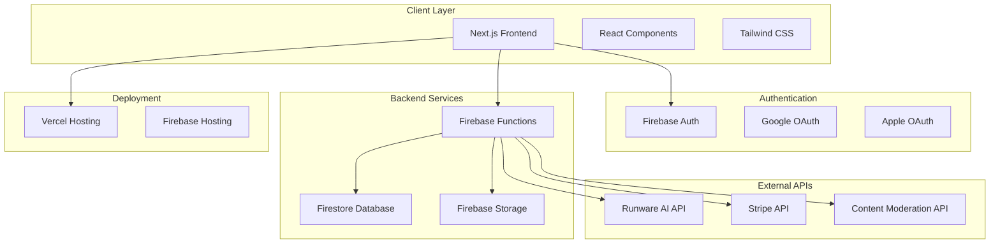

# Design Document

## Overview

Draworld is a Next.js-based web application that transforms children's drawings into animated videos using AI technology. The system is built on a modern tech stack including Firebase for backend services, Stripe for payments, and integrates with AI video generation APIs. The architecture follows a serverless approach with Firebase Functions handling backend logic and Firestore for data persistence.

## Architecture

### High-Level Architecture



### Technology Stack

- **Frontend**: Next.js 15, React 19, TypeScript, Tailwind CSS
- **Backend**: Firebase Functions (Node.js), Firestore, Firebase Storage
- **Authentication**: Firebase Auth with Google/Apple OAuth
- **Payments**: Stripe API with webhooks
- **AI Integration**: Runware AI API for video generation
- **Deployment**: Vercel for frontend, Firebase for backend services
- **Content Moderation**: Third-party content safety API

## Components and Interfaces

### Core Components Architecture

```mermaid
graph TD
    subgraph "Layout Components"
        A[Header]
        B[Footer]
        C[Navigation]
    end
    
    subgraph "UI Components"
        D[Button]
        E[Modal]
        F[VideoPlayer]
        G[ImageUploader]
        H[CreditDisplay]
    end
    
    subgraph "Feature Components"
        I[CreationWizard]
        J[PersonalGallery]
        K[PublicGallery]
        L[PaymentModal]
        M[PricingCards]
        N[BillingHistory]
        O[ReferralManager]
        P[UserProfile]
    end
    
    subgraph "Pages"
        M[HomePage (`/`)]
        N[CreatePage (`/create`)]
        O[PublicGalleryPage (`/gallery`)]
        P[PricingPage (`/pricing`)]
        Q[LoginPage / SignupPage]
        
        subgraph "Account Pages (`/account/*`)"
            R[MyCreationsPage (`/account/creations`)]
            S[BillingHistoryPage (`/account/billing`)]
            T[ReferralsPage (`/account/referrals`)]
            U[ProfileSettingsPage (`/account/profile`)]
        end
        
        subgraph "Legal & System Pages"
            V[TermsOfServicePage (`/terms-of-service`)]
            W[PrivacyPolicyPage (`/privacy-policy`)]
            X[NotFoundPage (`/404`)]
        end
    end
    
    A --> M
    A --> N
    A --> O
    A --> P
    I --> G
    I --> F
    J --> F
    K --> D
```

### Key Component Specifications

#### CreationWizard Component
- **Purpose**: Multi-step creation flow for video generation
- **Steps**: Upload → Crop → Prompt & Mood → Generate → Result
- **State Management**: React Context for wizard state
- **Features**: Progress tracking, validation, credit checking

#### VideoPlayer Component
- **Purpose**: Consistent video playback across the application
- **Features**: Custom controls, fullscreen, sharing integration
- **Formats**: MP4 support with fallbacks

#### ImageUploader Component
- **Purpose**: Handle image upload with validation and cropping
- **Features**: Drag-and-drop, camera access (mobile), file validation
- **Integration**: Firebase Storage for image persistence

#### PaymentModal Component
- **Purpose**: Stripe integration for credit purchases
- **Features**: Package selection, secure payment processing, receipt handling
- **Security**: No card data storage, PCI compliance

#### PricingPage Component
- **Purpose**: Displays credit packages and initiates the purchase flow
- **Features**: Renders multiple pricing cards from configuration, highlights popular options, triggers PaymentModal on selection
- **Data Source**: Fetches package details from static config with pricing: $1.99/100, $9.99/550 (50 bonus), $49.99/2900 (400 bonus), $99.99/6000 (1000 bonus)

#### BillingHistoryPage Component
- **Purpose**: Allows users to review their purchase and credit transaction history
- **Features**: Tabbed interface for "Order History" and "Credit History", displays data in tables with pagination
- **API Integration**: Uses GET /api/payments/history and GET /api/credits/history

#### PublicGalleryPage Component
- **Purpose**: Showcases curated public creations to inspire users
- **Features**: Masonry-style grid layout, infinite scroll, filtering and sorting controls (Trending, Newest, Most Popular)
- **API Integration**: Uses GET /api/gallery/public

#### PersonalGallery Component
- **Purpose**: User's private gallery for managing their creations
- **Features**: Grid layout with creation cards, hover actions, modal player, share/delete options
- **Empty State**: Displays encouraging message and CTA when no creations exist

#### ReferralManager Component
- **Purpose**: Manages friend invitations and tracks referral rewards
- **Features**: Unique referral link generation, referral history, reward tracking, social sharing integration
- **Rewards**: 30 credits for referrer on signup, 70 credits when referred friend creates first video

### API Interface Design

#### Firebase Functions Endpoints

```typescript
// User Management
POST /api/users/create
GET /api/users/profile
PUT /api/users/update

// Credit System
POST /api/credits/purchase
POST /api/credits/award
GET /api/credits/history
POST /api/credits/checkin

// Payment System
GET /api/payments/history
POST /api/payments/create-intent
POST /api/payments/webhook

// Video Generation
POST /api/videos/generate
GET /api/videos/{id}
DELETE /api/videos/{id}
PUT /api/videos/{id}/status

// Gallery & Sharing
GET /api/gallery/public
GET /api/gallery/user
POST /api/videos/share
GET /api/creation/{id}/result

// Referral System
GET /api/referrals/code
POST /api/referrals/track
GET /api/referrals/history

// Admin
POST /api/admin/credits/award
GET /api/admin/users
GET /api/admin/analytics
GET /api/admin/content/review
```

#### External API Integration

```typescript
// Runware AI Integration
interface VideoGenerationRequest {
  imageUrl: string;
  prompt: string;
  mood: 'playful' | 'heartwarming' | 'epic' | 'mysterious';
  userId: string;
}

// Stripe Integration
interface PaymentIntent {
  amount: number;
  currency: 'usd';
  metadata: {
    userId: string;
    creditPackage: string;
  };
}
```

## Data Models

### User Model
```typescript
interface User {
  id: string;
  email: string;
  displayName: string;
  profileImage?: string;
  credits: number;
  createdAt: Timestamp;
  lastLoginAt: Timestamp;
  referralCode: string;
  referredBy?: string;
  isFirstVideoGenerated: boolean;
  lastCheckinDate?: Timestamp;
}
```

### Video Creation Model
```typescript
interface VideoCreation {
  id: string;
  userId: string;
  title: string;
  prompt: string;
  mood: string;
  originalImageUrl: string;
  croppedImageUrl: string;
  videoUrl?: string;
  thumbnailUrl?: string;
  status: 'pending' | 'processing' | 'completed' | 'failed';
  isPublic: boolean;
  createdAt: Timestamp;
  completedAt?: Timestamp;
  shareCount: number;
  viewCount: number;
}
```

### Credit Transaction Model
```typescript
interface CreditTransaction {
  id: string;
  userId: string;
  type: 'earned' | 'spent' | 'purchased';
  amount: number;
  description: string;
  source: 'signup' | 'checkin' | 'referral' | 'purchase' | 'video_generation' | 'admin_award';
  relatedId?: string; // Payment ID, Video ID, etc.
  createdAt: Timestamp;
}
```

### Payment Model
```typescript
interface Payment {
  id: string;
  userId: string;
  stripePaymentIntentId: string;
  amount: number;
  currency: string;
  creditsAwarded: number;
  status: 'pending' | 'succeeded' | 'failed';
  createdAt: Timestamp;
  completedAt?: Timestamp;
}
```

### Referral Model
```typescript
interface Referral {
  id: string;
  referrerId: string;
  referredUserId: string;
  referralCode: string;
  signupBonusAwarded: boolean;
  firstVideoBonusAwarded: boolean;
  createdAt: Timestamp;
}
```

## Error Handling

### Client-Side Error Handling

```typescript
// Error Boundary Component
class ErrorBoundary extends React.Component {
  // Handle React component errors
}

// API Error Handler
const handleApiError = (error: any) => {
  switch (error.code) {
    case 'insufficient-credits':
      showCreditPurchaseModal();
      break;
    case 'content-moderation-failed':
      showContentModerationError();
      break;
    case 'generation-timeout':
      showGenerationTimeoutError();
      break;
    default:
      showGenericError();
  }
};
```

### Server-Side Error Handling

```typescript
// Firebase Function Error Handler
export const handleFunctionError = (error: any, context: string) => {
  console.error(`Error in ${context}:`, error);
  
  // Log to monitoring service
  logError(error, context);
  
  // Return appropriate HTTP status
  if (error.code === 'permission-denied') {
    return { status: 403, message: 'Access denied' };
  }
  
  return { status: 500, message: 'Internal server error' };
};
```

### Error Recovery Strategies

1. **Network Errors**: Automatic retry with exponential backoff
2. **Payment Failures**: Clear error messages with retry options
3. **Generation Failures**: Refund credits and offer retry
4. **Upload Failures**: Resume capability for large files
5. **Authentication Errors**: Automatic token refresh

## Testing Strategy

### Unit Testing
- **Components**: React Testing Library for UI components
- **Functions**: Jest for Firebase Functions
- **Utilities**: Jest for helper functions and utilities
- **Coverage Target**: 80% code coverage

### Integration Testing
- **API Endpoints**: Test Firebase Function endpoints
- **Payment Flow**: Stripe test mode integration
- **Authentication**: Firebase Auth emulator testing
- **File Upload**: Firebase Storage emulator testing

### End-to-End Testing
- **User Flows**: Playwright for critical user journeys
- **Cross-Browser**: Chrome, Safari, Firefox testing
- **Mobile Testing**: Responsive design validation
- **Performance**: Lighthouse CI integration

### Testing Environment Setup

```typescript
// Jest Configuration
module.exports = {
  testEnvironment: 'jsdom',
  setupFilesAfterEnv: ['<rootDir>/src/test/setup.ts'],
  moduleNameMapping: {
    '^@/(.*)$': '<rootDir>/src/$1',
  },
};

// Firebase Emulator Configuration
{
  "emulators": {
    "auth": { "port": 9099 },
    "firestore": { "port": 8080 },
    "functions": { "port": 5001 },
    "storage": { "port": 9199 }
  }
}
```

## Security Considerations

### Authentication & Authorization
- Firebase Auth with secure token validation
- Role-based access control for admin features
- Session management with automatic token refresh

### Data Protection
- GDPR/CCPA compliance with data export/deletion
- Encrypted data transmission (HTTPS)
- Secure file upload with content validation

### Payment Security
- PCI DSS compliance through Stripe
- No sensitive payment data storage
- Webhook signature verification

### Content Moderation
- Automated content safety checks on upload
- Manual review process for flagged content
- User reporting system for inappropriate content

### Rate Limiting
- API rate limiting to prevent abuse
- User-based generation limits
- IP-based request throttling

## Performance Optimization

### Frontend Optimization
- Next.js Image optimization for artwork thumbnails
- Code splitting for route-based chunks
- Service Worker for offline capability
- CDN integration for static assets

### Backend Optimization
- Firestore query optimization with proper indexing
- Firebase Storage CDN for video delivery
- Function cold start optimization
- Caching strategies for frequently accessed data

### Video Processing Optimization
- Asynchronous video generation with status updates
- Progress tracking for user engagement
- Thumbnail generation for quick previews
- Compression optimization for faster delivery

## Deployment Strategy

### Environment Configuration
- **Development**: Local Firebase emulators
- **Staging**: Firebase staging project
- **Production**: Firebase production project with Vercel

### CI/CD Pipeline
```yaml
# GitHub Actions Workflow
name: Deploy
on:
  push:
    branches: [main]
jobs:
  deploy:
    runs-on: ubuntu-latest
    steps:
      - uses: actions/checkout@v2
      - name: Setup Node.js
        uses: actions/setup-node@v2
      - name: Install dependencies
        run: npm ci
      - name: Run tests
        run: npm test
      - name: Build application
        run: npm run build
      - name: Deploy to Vercel
        run: vercel --prod
      - name: Deploy Firebase Functions
        run: firebase deploy --only functions
```

### Monitoring & Analytics
- Firebase Analytics for user behavior tracking
- Error monitoring with Sentry integration
- Performance monitoring with Web Vitals
- Business metrics dashboard for key KPIs

## Page Specifications

### Public Pages

#### HomePage (`/`)
- **Layout**: Hero section, social proof, how-it-works, featured creations, testimonials, final CTA
- **Components**: Header (logged-out state), Hero, SocialProofBar, HowItWorksSection, FeaturedCreations, Testimonials, Footer
- **CTAs**: "Create Your Masterpiece for Free" → `/create`, "Sign Up and Start Creating" → `/signup`

#### PublicGalleryPage (`/gallery`)
- **Layout**: Filter controls, masonry grid, lightbox modal
- **Components**: GalleryFilters, PublicGallery, VideoLightbox
- **Features**: Sort by Trending/Newest/Most Popular, infinite scroll, share functionality

#### PricingPage (`/pricing`)
- **Layout**: Pricing cards, value proposition, FAQ section
- **Components**: PricingCards, PaymentModal, ValueProposition, FAQ
- **Packages**: 4 tiers with bonus credit highlights

### Authentication Pages

#### LoginPage (`/login`) & SignupPage (`/signup`)
- **Layout**: Centered form with social auth options
- **Components**: AuthForm, SocialAuthButtons
- **Features**: Google/Apple OAuth, email/password fallback, form validation

#### ForgotPasswordPage (`/forgot-password`) & ResetPasswordPage (`/reset-password`)
- **Layout**: Simple form with clear instructions
- **Components**: PasswordResetForm
- **Features**: Email-based password reset with secure tokens

### Core Application Pages

#### CreatePage (`/create`)
- **Layout**: Multi-step wizard interface
- **Components**: CreationWizard, ImageUploader, PromptEditor, MoodSelector, GenerationProgress
- **Steps**: Upload → Crop → Prompt & Mood → Generate → Result
- **Features**: Credit checking, authentication gating, progress tracking

#### CreationResultPage (`/creation/{id}/result`)
- **Layout**: Large video player with action buttons
- **Components**: VideoPlayer, ShareModal, ActionButtons
- **Features**: Shareable URLs, download functionality, social sharing

### Account Management Pages

#### MyCreationsPage (`/account/creations`)
- **Layout**: Grid of creation cards with empty state
- **Components**: PersonalGallery, CreationCard, VideoModal
- **Features**: Hover actions, share/delete options, modal playback

#### BillingHistoryPage (`/account/billing`)
- **Layout**: Tabbed interface with current balance display
- **Components**: BillingHistory, CreditBalance, TransactionTable
- **Tabs**: Order History, Credit History with detailed transaction logs

#### ReferralsPage (`/account/referrals`)
- **Layout**: Referral link section, reward tracking, social tasks
- **Components**: ReferralManager, RewardTracker, SocialTasks
- **Features**: Unique link generation, reward notifications, UGC task submission

#### ProfileSettingsPage (`/account/profile`)
- **Layout**: Profile form with account settings
- **Components**: UserProfile, PasswordChange, AccountSettings
- **Features**: Display name editing, password updates, account deletion

### System Pages

#### TermsOfServicePage (`/terms-of-service`) & PrivacyPolicyPage (`/privacy-policy`)
- **Layout**: Legal document with navigation
- **Components**: LegalDocument, TableOfContents
- **Features**: Searchable content, last updated timestamps

#### NotFoundPage (`/404`)
- **Layout**: Friendly error message with navigation options
- **Components**: ErrorMessage, NavigationSuggestions
- **Features**: Helpful links back to main sections

## State Management Strategy

### Global State (React Context)
- **AuthContext**: User authentication state, profile data
- **CreditContext**: Current credit balance, transaction updates
- **CreationContext**: Active creation state during wizard flow

### Local State (Component State)
- **Form State**: Individual form inputs and validation
- **UI State**: Modal visibility, loading states, error messages
- **Cache State**: Recently fetched data for performance

### Server State (React Query/SWR)
- **API Data**: Cached responses from Firebase Functions
- **Real-time Updates**: Firestore subscriptions for live data
- **Optimistic Updates**: Immediate UI updates with rollback capability

This comprehensive design provides detailed specifications for implementing all features from the PRD while maintaining clear separation of concerns and scalable architecture patterns.